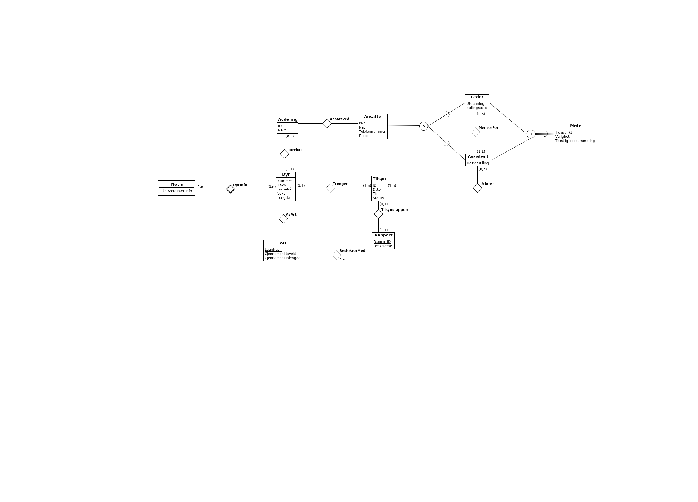

Oppgave 1)
1. Total spesialisering og disjunkte subklasser
>> Total spesialisering betyr at alle entitene i superentitetstypen må være med i minst èn av subentitetstypene.
>> Disjunkte subklasser betyr at superentitetstypen kan maks være i en av subklassene.

2. Disjunkt og total
>> Superentiteten må være medlem av èn subklasse. Kan se for deg en modellering med ansatte på ett sykehus. Ansatte som supertype og leger, sykepleiere, vaktmester, ... som subtyper. De ansatte må være enten leger eller sykepleiere eller vaktmester osv... Kan ikke være medlem av flere subklasser.
Disjunkt og delvis
>> Superentiteten kan være medlem av maks èn subklasse. Database for å ha oversikt over tilhørighet av deltakere på ett seminar. Deltakerne kan komme fra en bedrift, fra arrangøren av seminaret, de kan være medlem av foreningen som arrangerer, eller de kan bare droppe inn.
Overlappende og total
>> Superentiteten må minst være medlem av èn, men kan også være medlem av flere subklasser. Modellering av deltakere i en friidrettskonkurranse. Deltakeren må minst være medlem av en gren, men kan også konkurrere i flere. 
Overlappende og delvis
>> Superentiteten kan enten være, eller ikke medlem av en eller flere subklasser. Modellere hvilke biler folk eier. Personer som supertype og bilmerker som subklasser. Personen må ikke nødvendigvis eie en bil, men kan også eie flere.

3. Disse er syntaktisk gale:
>> Figur 4 er syntaktisk gal, for man kan ikke ha en "is a" forbindelse til ingenting. Disjunkt betyr også at linjene inn er subklasser, og må derfor ha en superklasse.
>> Figur 1. Kan ikke ha en relasjonsforbindelse til en spesialisering. Spesialiseringen skjer på entiteten, ikke relasjonen.

Oppgave 2)

Oppgave 3)
1. Primærnøkkel og entitetsintegritet
>> Primærnøkkel er den attributen som er unik for hver eneste entitet. Dermed er det dette som gjør det mulig å skille mellom ulike instanser av en entitetsklasse. Derfor bryter man entitetsintegriteten dersom det eksisterer to like primærnøkler eller dersom primærnøkkelen er NULL, for da kan det bli umulig å skille mellom ulike entiteter.
2. Fremmednøkkel og referanseintegritet
>> Fremmednøkkel er den attributen som referer til andre entiteter i samme eller andre databaser. Dersom det finnes to eller flere like av disse blir det umulig å skille entiteter fra hverandre, noe som kan føre til feil i databasen.

Oppgave 4)
1. Oversettelse ER -> RDB
>> Eksamen(Eksamensnr(PK), Fagkode, Hjelpemiddelkode)

>> Student(StudentNr(PK), Navn)

>> HarEksamen(EksamensNr(PK og FK), StudentNr(PK og FK)) – Binder sammen studenter og eksamen. Ingen NULL

>> Oppsatt(EksamensNr(PK og FK), StudentNr(PK og FK), Dato, StudentPlassering, RomNr(PK og FK)) – Binder student, Eksamen og eksamenslokale sammen med dato og plassering.

>> Eksamenslokale(RomNr(PK), Navn, Kapasitet)

>> Bord(BordNr(PK), Type, RomNr(FK)) – RomNr binder lokale og bord sammen. IKKE NULL

>> Stol(StolNr(PK), Type, RomNr(FK)) – Samme.

2. Relasjonsalgebra
>> π Hotellnr,Navn(Hotell) 
---------------------------

>>π Hotellnr, Navn(σ Omraade == "Barcelona" (Hotell))
------------------------------------------------------

>>Joined = Hotell ⋈ Hotellrom

>>Over100kvm = σ m2str>100 (Joined)

>>RomNrOgNavn = π HotellNr,Navn (Over100kvm)
---------------------------------------------

>> Joined = (Rombestilling⋈Hotellrom)

>> (σ Varighet>7 (Joined)) 

>> F BestillingsNr (Joined)
---------------------------------------
>>KundeogRomb = Kunde ⋈ Rombestilling

>>HotellogRom = Hotell⋈Hotellrom

>>Alt = KundeogRomb ⋈ HotellogRom

>>TelefonnummerogNavn = π Fornavn,Etternavn,Telefonnr(σ Omraade == "Madrid"(Alt))
----------------------------------------------------------------------------
>>Lettere = π Fornavn, Etternavn, Varighet (KundeogRomb)

>>OleTabell = σ Fornavn == "Ole"(Lettere)

>>OgHansen = σ Etternavn == "Hansen" (OleTabell)

>>Sortert = Varighet ASC